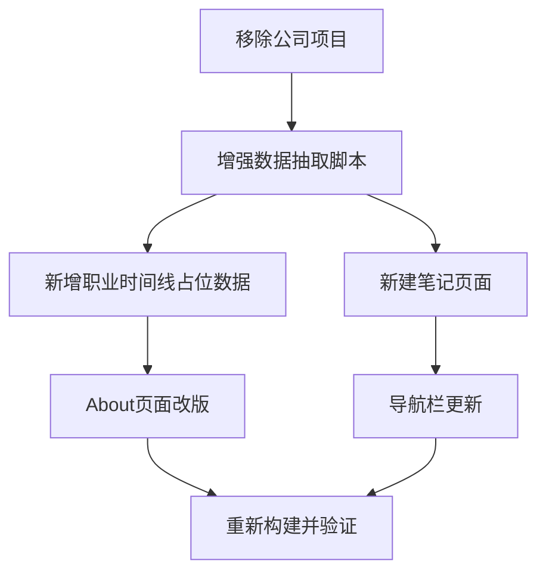

# Personal Card 全面升级计划 v2

## 标杆调研总结

调研了 6 个标杆站点，提炼出关键设计模式：

- **overreacted.io** (Dan Abramov)：极致简洁，标题 + 日期 + 一句话金句摘要，无分类无标签
- **antfu.me** (Anthony Fu)：按年份分组，Blog + Notes 分层，标题 + 阅读时长 + 语言标签
- **leerob.io** (Lee Robinson)：纯标题链接列表，最极简，强调内容而非时间
- **blog.vonng.com** (冯若航)：专栏化运营，标题 + 摘要 + 标签 + 阅读时长，金句式摘要引人入胜
- **idoubi.ai** (艾逗笔)：博客/产品/关于三分，博客是编号时间线
- **xdash.me** (范冰)：叙事式 About 页，用人格魅力建立连接

**核心洞察（决定设计方向的关键判断）**：

1. **不做"大而全"的分类堆砌** -- 124 篇笔记按 12 个分类铺开会显得杂乱。参考 antfu 的"按年份分组"和 vonng 的"专栏聚焦"，采用年份分组 + 主题专栏
2. **金句式摘要 > 分类标签** -- 每篇笔记的第一句话（根节点命题）就是最好的摘要，比分类标签更有吸引力
3. **About 讲故事而非堆数据** -- 范冰的叙事式 About 页远比数据墙更有人格魅力。"核心成果数据墙"从原计划中移除，改为叙事式结构

## 变更清单（相比 v1 计划）

**保留的**：

- 移除 bk-sap-api / bk-sap-mcp
- 增强数据抽取脚本（新增 notes 提取）
- 职业时间线占位数据
- 导航栏更新

**调整的**：

- Blog 页面：从"分类标签卡片网格"改为"年份分组 + 金句摘要列表"（参考 antfu + overreacted）
- About 页面：从"数据墙 + 时间线堆砌"改为"叙事式简介 + 时间线 + Playbook"

**剔除的**：

- ~~核心成果数据墙~~ -- 首页 StatsPanel 已有数据展示，About 页不重复
- ~~首页措辞优化~~ -- 当前措辞已经足够，valueStory 数据已在项目详情页展示，不需要额外改动
- ~~ProjectCard 展示核心价值~~ -- 卡片空间有限，valueStory 放在详情页更合适

## 一、数据层改造

### 1.1 移除公司项目

- `[overrides.json](personal-card/src/data/overrides.json)`：删除 `bk-sap-api` 和 `bk-sap-mcp` 两个条目
- `[extract-workspace-data.ts](personal-card/scripts/extract-workspace-data.ts)`：`SKIP_DIRS` 新增 `'bk-sap-api'`, `'bk-sap-mcp'`

### 1.2 增强数据抽取：学习笔记元数据

在 `extract-workspace-data.ts` 新增 `extractNotes()` 函数：

```typescript
interface NoteInfo {
  title: string;
  date: string;        // YYYY-MM-DD
  category: string;    // 顶层目录名，如 ai-tools, self-growth
  subcategory: string; // 子目录名，如 agent-skill, ai-ide
  tags: string[];
  slug: string;        // 文件名去掉日期前缀
  path: string;        // 相对路径
}
```

解析策略：

- **有 YAML frontmatter 的**（`---` 包裹）：直接提取 `title`, `date`, `category`, `tags`
- **无 frontmatter 的**：从 `# 标题` 提取 title，从文件名 `YYYY-MM-DD-xxx.md` 提取 date，从目录路径推断 category/subcategory

输出到 `workspace-data.json` 的 `notes: NoteInfo[]` 字段。

### 1.3 职业时间线占位数据

在 `overrides.json` 新增 `career` 数组，预置三段经历供用户填写：

```json
"career": [
  { "company": "腾讯", "role": "（请填写）", "period": "20XX - 至今", "highlights": ["（请填写核心成果）"] },
  { "company": "微拍", "role": "（请填写）", "period": "20XX - 20XX", "highlights": ["（请填写核心成果）"] },
  { "company": "百度", "role": "（请填写）", "period": "20XX - 20XX", "highlights": ["（请填写核心成果）"] }
]
```

## 二、页面改造

### 2.1 笔记页面（`/blog`） -- 参考 antfu.me + overreacted.io

新建 `[src/pages/blog/index.astro](personal-card/src/pages/blog/index.astro)`

**设计核心**：清爽、可浏览、有节奏感

```
标题 + 统计行
  "学习笔记" -- 124 篇 · 12 个主题

按年份分组（参考 antfu）：
  2026
    ┌─────────────────────────────────────────────────┐
    │ 02-21  健康学习到150岁 - 人体系统调优不完全指南   │
    │        人体是一套可调优的生物系统               │
    │        [自我成长] [健康优化]                     │
    │                                                 │
    │ 02-15  VoidZero - 下一代统一 JavaScript 工具链   │
    │        尤雨溪的新战场：统一 JS 工具链            │
    │        [开发工具]                               │
    │                                                 │
    │ 02-15  tmux 终端复用器完全精读                   │
    │        一个窗口管理所有会话                      │
    │        [命令行工具]                              │
    └─────────────────────────────────────────────────┘
  2025
    ...
```

**关键设计决策**：

- **按年份分组而非按分类**：时间线叙事更自然，避免 12 个分类的信息过载
- **每条笔记**：日期 + 标题 + 一句话摘要（从笔记的根节点命题/首段提取）+ 分类标签（小字灰色）
- **不做笔记详情页**：点击标题不跳转，因为笔记原文在独立 Git 仓库，不属于 Astro 内容
- **不做分类筛选交互**：保持静态，分类信息作为每条笔记的小标签展示即可
- **阅读时长**（可选）：如果笔记有字数统计，可以像 antfu 一样显示 `· 8min`

### 2.2 About 页面改版 -- 参考 xdash.me 叙事风格

重构 `[src/pages/about.astro](personal-card/src/pages/about.astro)`

**新结构**：

1. **叙事式个人简介**（改造）
  - 从当前的纯描述改为有温度的自我叙事
  - 参考范冰风格：不是"我做了什么"，而是"我为什么做这些"
  - 保留技术定位，但加入个人理念和追求
2. **职业经历时间线**（新增）
  - 垂直时间线 UI，左侧圆点 + 年份线，右侧卡片
  - 每段经历：公司名 + 职位 + 时间段 + 2-3 条核心成果
  - 预置占位内容，用户可直接编辑 `overrides.json` 填写
3. **Engineering Playbook**（保留优化）
  - 保持现有的三栏统计卡片
4. **持续学习**（保留）
  - 笔记统计 + 学习主题标签云
  - 新增"查看全部笔记 →"链接指向 `/blog`
5. **联系方式**（保留）

### 2.3 导航栏更新

`[src/components/Navbar.astro](personal-card/src/components/Navbar.astro)` 新增"笔记"入口：

```javascript
const navItems = [
  { label: '首页', href: '/' },
  { label: '项目', href: '/projects' },
  { label: '笔记', href: '/blog' },
  { label: '关于', href: '/about' },
];
```

用"笔记"而非"博客"——因为 124 篇内容的实际性质是学习精读笔记，不是原创博客文章。这个命名更准确，也更有辨识度。

## 三、截图问题

根因：服务器 headless browser 缺少中文字体（`fonts-noto-cjk`）。

**两个方案**：

- 方案 A：安装 `fonts-noto-cjk` 后重新用 Playwright 截图
- 方案 B：用户手动截图放到以下路径

文件路径：

- `personal-card/public/screenshots/infohunter.png`
- `personal-card/public/screenshots/TrendRadar.png`
- `personal-card/public/screenshots/truthsocial-trump-monitor.png`
- `personal-card/public/screenshots/github-sentinel.png`

## 四、实施顺序




注意：About 页面和笔记页面可以并行开发，因为它们没有依赖关系。

## 五、不做的事（及理由）

- ~~核心成果数据墙~~ -- 首页 StatsPanel 已有，About 页重复展示是信息冗余
- ~~首页 ProjectCard 措辞优化~~ -- 当前描述已足够清晰，valueStory 在详情页展示
- ~~分类筛选交互组件~~ -- 124 篇笔记按年份分组已经足够清晰，引入 React Island 得不偿失
- ~~笔记详情页~~ -- 笔记原文在独立 Git 仓库，不纳入 Astro 内容系统
- ~~Blog 页面的卡片式网格布局~~ -- 标杆站点一致表明：列表 > 网格，简洁 > 花哨

